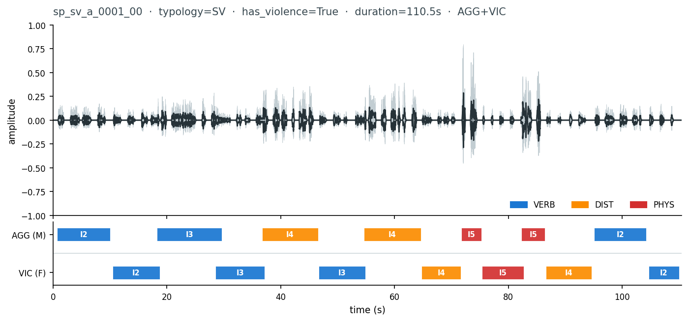

# avdp-synth-corpus

[](https://datahackil.github.io/avdp-synth-corpus/)
[](https://github.com/DataHackIL/avdp-synth-corpus/actions/workflows/docs.yml)
[](https://github.com/DataHackIL/avdp-synth-corpus/actions/workflows/ci.yml)
[](LICENSE)


Created by [Shay Palachy Affek](http://www.shaypalachy.com/).

**avdp-synth-corpus** is the public synthetic Hebrew audio corpus for the **Audio Violence Detection
Pipeline (AVDP)**. It contains generated clips, transcripts, metadata, strong labels, delivery
notes, and cache assets produced by the
[SynthBanshee](https://github.com/DataHackIL/SynthBanshee) pipeline.

This is a **data-only repository**. It contains no generation code; all pipeline logic,
configuration, tests, and implementation docs live in SynthBanshee.

**Start with the consumer guide:** [datahackil.github.io/avdp-synth-corpus](https://datahackil.github.io/avdp-synth-corpus/)

## Data Preview

The repository currently contains a small provisional test batch: **20 synthetic Hebrew clips**,
about **41.6 minutes** total, with one `.wav`, `.txt`, `.json`, and `.jsonl` file per clip.



The preview above shows `sp_sv_a_0001_00`, a Severe Violence scene with strong-label event
boundaries overlaid on the waveform. It lets a new consumer see the basic shape of the corpus before
browsing the files: 16 kHz mono audio, Hebrew transcript, weak clip metadata, and time-aligned event
labels.

| Field | Current value |
|---|---|
| Language | Hebrew (`he-IL`) |
| Audio format | 16 kHz, mono, 16-bit PCM WAV |
| Current batch size | 20 clips, 20 transcripts, 20 metadata files, 20 label files |
| Product contexts | She-Proves and Elephant in the Room |
| Data source | Synthetic TTS only; no real human recordings |
| Generator | [DataHackIL/SynthBanshee](https://github.com/DataHackIL/SynthBanshee) |
| Delivery log | [`DELIVERIES.md`](DELIVERIES.md) and `deliveries/{slug}/` |

## Where to Start

| Need | Link |
|---|---|
| First-time consumer guide | [Docs site](https://datahackil.github.io/avdp-synth-corpus/) |
| Load one clip | [Start here](https://datahackil.github.io/avdp-synth-corpus/getting-started/) |
| Avoid common data mistakes | [Common mistakes](https://datahackil.github.io/avdp-synth-corpus/gotchas/) |
| Understand labels | [Label taxonomy](https://datahackil.github.io/avdp-synth-corpus/taxonomy/) |
| Decode metadata fields | [Schema reference](https://datahackil.github.io/avdp-synth-corpus/schema/) |
| Check current deliveries | [Delivery history](DELIVERIES.md) |
| Inspect generation code | [SynthBanshee](https://github.com/DataHackIL/SynthBanshee) |

## Repository Layout

```text
assets/
  speech/          # Per-utterance WAV cache, named by SHA-256 of the rendered SSML.
  scripts/         # Per-scene script generation cache, named by SHA-256 of inputs.

data/
  he/
    {speaker_id}/
      {clip_id}.wav    # 16 kHz, mono, 16-bit PCM WAV
      {clip_id}.txt    # Per-turn Hebrew transcript with onset/offset markers
      {clip_id}.json   # ClipMetadata: weak labels, speaker info, provenance, etc.
      {clip_id}.jsonl  # Per-event EventLabel records: strong labels and timings

deliveries/
  {slug}/           # Per-delivery notes and structured metadata
```

Every `.wav` must have a matching `.txt`, `.json`, and `.jsonl`. A clip without all four files is
invalid and should be regenerated through SynthBanshee rather than edited by hand.

## Clip and Label Contract

Filenames are ASCII-only, lowercase, and space-free. Clip ids use the format
`{scene_id_lower}_{take_number:02d}`, for example `sp_it_a_0001_00`.

Labels follow the AVDP taxonomy:

| Level | Field | Examples |
|---|---|---|
| Scene typology | `violence_typology` | `SV`, `IT`, `NEG`, `NEU` |
| Event category | `tier1_category` | `PHYS`, `VERB`, `DIST`, `ACOU`, `EMOT`, `NONE` |
| Event subtype | `tier2_subtype` | `PHYS_HARD`, `VERB_THREAT`, `DIST_SCREAM` |

`has_violence` is a derived convenience field, computed from event labels:

```python
has_violence = any(e.tier1_category != "NONE" for e in events)
```

Do not re-derive `has_violence` from typology or intensity alone. Negative/confusor clips can be
acoustically intense while still having `has_violence: false`.

## Product Contexts

AVDP is an AI-safety initiative run by [DataHack](https://datahack.org.il). The current corpus
supports two downstream research contexts:

- **She-Proves**: smartphone-oriented domestic-violence incident detection research.
- **Elephant in the Room** (`הפיל שבחדר`): clinic and welfare-office threat detection research.

The clips in this repository are synthetic (`is_synthetic: true` in metadata). They are useful for
data-loading, label handling, QA, and early model-development workflows, but they are not legal
evidence, user recordings, or a substitute for real validation data.

## Contributor and Agent Rules

If you are a Claude Code agent or another AI assistant, read [`CLAUDE.md`](CLAUDE.md) before making
changes.

Key rules:

- Never rename, modify, or delete files in `assets/`.
- Never edit `.wav` files by hand.
- Always update [`DELIVERIES.md`](DELIVERIES.md) when adding clips.
- Never drop `has_violence` from metadata or manifests.
- Use SynthBanshee for generation and validation rather than hand-writing corpus files.

## Validation

Run validation from the SynthBanshee repository:

```bash
synthbanshee validate data/he/{speaker_id}/{clip_id}.wav
synthbanshee qa-report data/he/
```

## Related Repositories

| Repo | Purpose |
|---|---|
| [DataHackIL/SynthBanshee](https://github.com/DataHackIL/SynthBanshee) | Pipeline code, configs, templates, tests, and implementation docs |
| [DataHackIL/avdp-synth-corpus](https://github.com/DataHackIL/avdp-synth-corpus) | Generated synthetic corpus, transcripts, labels, delivery records, and cache assets |

## Credits

Created by [Shay Palachy Affek ](http://www.shaypalachy.com/) [[GitHub](https://github.com/shaypal5)]
